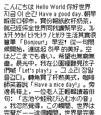
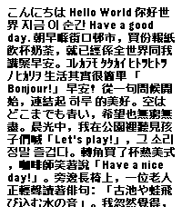
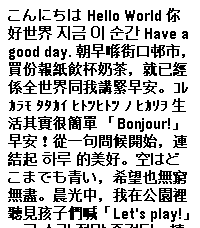
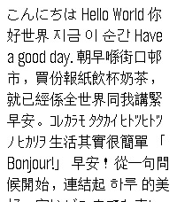
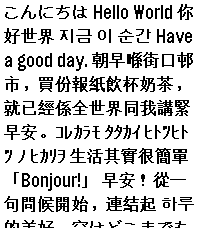
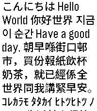
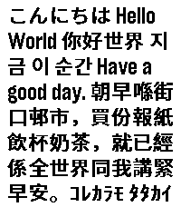

# Tumbled Bitmap Font 圆石点阵黑

This font is designed for PebbleOS, containing approximately 8000 Chinese characters, as well as support for Japanese and Korean. Most of the variants are modified and adjusted from existing open-source fonts. However, the Chinese characters in TUMBLED_18 were designed from scratch due to the lack of alternative open-source fonts in similar sizes.

If you are looking for more condensed font similar to PebbleOS's Gothic, check out [Kyanite Bitmap Font](https://github.com/TsFreddie/KYANITE).

本字体是为 PebbleOS 设计的点阵字体，包含约8000个简繁汉字，以及日语与韩语的支持。大部分大小的字体是使用现有的开放字体修改与加工调整而来。其中 TUMBLED_18 的汉字部分则因为没有现有的开放字体，所以是从头开始手工设计的。

如果你更喜欢与PebbleOS的Gothic类似的压缩宽度的字体，推荐 [Kyanite Bitmap Font](https://github.com/TsFreddie/KYANITE).

## Variants

TUMBLED_14

- Directly generated from [Fusion Pixel Font](https://github.com/TakWolf/fusion-pixel-font) for its readability, added missing glyphs to reach our target.

TUMBLED_18

- Designed from scratch, and used [Galmuri](https://github.com/quiple/galmuri) for hiraganas, katakanas and hanguls.

TUMBLED_24

- Used [Unifont](https://unifoundry.com/unifont/index.html) as a reference and adjusted strokes to be more aesthetically similar to Pebble's Gothic, with redesigned hiraganas, katakanas and bopomofos.

TUMBLED_28

- Directly generated from [Source Han Sans](https://github.com/adobe-fonts/source-han-sans). Due to the larger size, the generated ones are generally readable without any modification.

## Preview

| Font Variant | Regular                                        | Bold                                                     |
| ------------ | ---------------------------------------------- | -------------------------------------------------------- |
| TUMBLED_14   |  |  |
| TUMBLED_18   |  |  |
| TUMBLED_24   |  |  |
| TUMBLED_28   |  |  |

## Progress & Roadmap

- [x] TUMBLED_14 10801 / 10801 (100%)
- [ ] TUMBLED_18 10257 / 10801 (94%)
- [x] TUMBLED_24 10801 / 10801 (100%)
- [x] TUMBLED_28 10801 / 10801 (100%)

- [ ] Provide hant and jp version with regional glyph shapes

## Build

To build the fonts, [PebbleFontTool](https://github.com/TsFreddie/PebbleFontTool) is available as a separate repository.

```bash
# Clone the scripts
git clone https://github.com/TsFreddie/PebbleFontTool.git

# Setup the build environment
cd PebbleFontTool
bun install
cd..

# Run the build script
bun run ./build.js
```

## Licenses

This repository and packaged fonts are licensed under OFL 1.1.

## Acknowledgements

[Unifont](https://unifoundry.com/unifont/index.html) ([OFL 1.1](https://unifoundry.com/OFL-1.1.txt) Licensed) is used both as a design reference for TUMBLED_24 and TUMBLED_18, and as a glyph availability reference for other fonts.

[Fusion Pixel Font](https://github.com/TakWolf/fusion-pixel-font) ([OFL 1.1](https://github.com/TakWolf/ark-pixel-font/blob/master/LICENSE-OFL) Licensed) is used directly
for generating TUMBLED_14.

[Source Han Sans](https://github.com/adobe-fonts/source-han-sans) ([OFL 1.1](https://github.com/adobe-fonts/source-han-sans/blob/master/LICENSE.txt) licensed) is used directly for generating TUMBLED_28.

[Galmuri](https://github.com/quiple/galmuri) ([OFL 1.1](https://github.com/quiple/galmuri/blob/main/ofl.md) licensed) is used as the design for hangul glyphs for several fonts.
