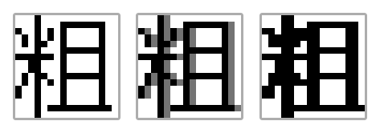

# Tumbled Bitmap Font 圆石点阵黑

## Design Principle

- Designed to be used in PebbleOS or other embedded devices
- Automatic bold weight convertion

## Variants

TUMBLED_14

- Used [Ark Pixel Font](https://github.com/TakWolf/ark-pixel-font) as the base design for its readability. TUMBLED_14 will focus on designing missing glyphs.

TUMBLED_18

- NOT IN PROGRESS, expected to be designed from stratch based on TUMBLED_24.

TUMBLED_24

- Used [Unifont](https://unifoundry.com/unifont/index.html) as a reference and re-designed from scratch. Focusing on designing with larger apparent size than Unifont, and careful consideration with BOLD conversion compatibilty. TUMBLED_24 should also be sans-serif rather than serif based like Unifont.

TUMBLED_28

- Directly generated from [Source Han Sans](https://github.com/adobe-fonts/source-han-sans). Due to the larger size, the generated ones are generally readable without any modification. Expected to be touched up to fix stroke width only.

## Bold Conversion

Bold font is generated by copying the glyph 1px to the right

This conversion cuts the design work in half by not having to worry about making dedicated BOLD variants.

However, designing thin variants now requires careful consideration to make sure the BOLD ones are also readable. Luckily, generally, only TUMBLED_18 and TUMBLED_24 requires the most effort to make sure the bold version is readable.

## Codepoints Coverage

> PebbleOS currently works directly with codepoints with no concept of graphemes / glyphs.

For CJK codepoints specifically, this font target specific standard documents. These documents are compiled into a gaint codepoint list and use the following steps to determine which to include:

- Read [pages](./data/pages) directory for all the de-duplicated codepoints
- Remove all codepoints exceeds 16 bits
- Read [extra](./data/pages/extra) directory for additional codepoints
- Reference the [FREQUENCY](./data/FREQUENCY) file and cut the extra character until we reached total 10500 character
- Read [others](./data/pages/others) directory and add them to the final set

The current hard cap PebbleOS can hold in a single PBF file is 10922 16-bit codepoints.
We set our limit to 10500 to leave extra spaces for missing characters in other languages.

## Preview

TUMBLED_14

TUMBLED_14_BOLD

TUMBLED_24

TUMBLED_24_BOLD

TUMBLED_28

TUMBLED_28_BOLD

## Licenses

Build tools are licensed under MIT.

Generated font are licensed under OFL 1.1.

## Acknowledgements

[Unifont](https://unifoundry.com/unifont/index.html) ([OFL 1.1](https://unifoundry.com/OFL-1.1.txt) Licensed) is used both as a design reference for TUMBLED_24 and TUMBLED_18, and as a glyph availability reference for other fonts.

[Fusion Pixel Font](https://github.com/TakWolf/fusion-pixel-font) ([OFL 1.1](https://github.com/TakWolf/ark-pixel-font/blob/master/LICENSE-OFL) Licensed) is used directly 
for generating TUMBLED_14.

[Source Han Sans](https://github.com/adobe-fonts/source-han-sans) ([OFL 1.1](https://github.com/adobe-fonts/source-han-sans/blob/master/LICENSE.txt) licensed) is used directly for generating TUMBLED_28.

[Galmuri](https://github.com/quiple/galmuri) ([OFL 1.1](https://github.com/quiple/galmuri/blob/main/ofl.md) licensed) is used as the design for hangul glyphs for several fonts.

A [FREQUENCY](./data/FREQUENCY) file derived from "[Chinese character list from 2.5 billion words corpus ordered by frequency](https://faculty.blcu.edu.cn/xinghb/zh_CN/article/167473/content/1437.htm)" is used as a reference to reduce the number of glyphs supported.
