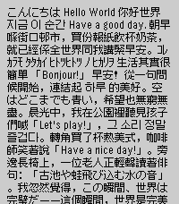
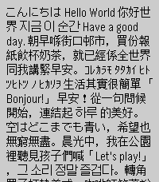
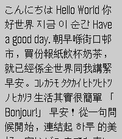
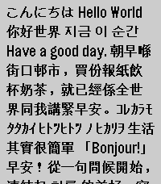
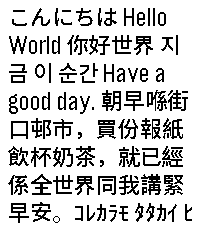
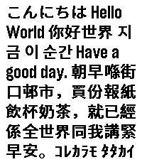
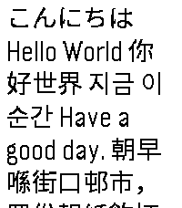
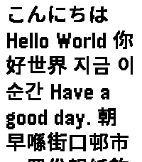
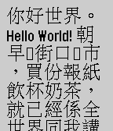
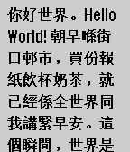

# Tumbled Bitmap Font 圆石点阵黑

This font is designed for PebbleOS, containing approximately 8100 Chinese characters, as well as support for Japanese and Korean. Most of the variants are modified and adjusted from existing open-source fonts. However, the Chinese characters in TUMBLED_18 were designed from scratch due to the lack of alternative open-source fonts in similar sizes.

If you are looking for more condensed font similar to PebbleOS's Gothic, check out [Kyanite Bitmap Font](https://github.com/TsFreddie/KYANITE).

本字体是为 PebbleOS 设计的点阵字体，包含约8100个简繁汉字，以及日语与韩语的支持。大部分大小的字体是使用现有的开放字体修改与加工调整而来。其中 TUMBLED_18 的汉字部分则因为没有现有的开放字体，所以是从头开始手工设计的。

如果你更喜欢与PebbleOS的Gothic类似的压缩宽度的字体，推荐 [Kyanite Bitmap Font](https://github.com/TsFreddie/KYANITE).

## Download 下载

**[Download the latest release 下载最新版本](https://github.com/TsFreddie/TUMBLED/releases/latest)**

[Coverage Report 收字覆盖报告](https://github.com/TsFreddie/PebbleFontTool#document-coverage)

### Packs 字体包

Packs are named `TUMBLED_<locale>_<watch>[_LITE|_MINI].pbl`. Each release ships
the full pack plus reduced ones. The full packs include every font; the reduced
packs leave out the fonts that notifications never use. Every pack exists once
per language.

字体包命名为 `TUMBLED_<语言>_<手表>[_LITE|_MINI].pbl`。每次发布都会提供完整包和精简包。完整包包括所有字体，精简包不包括通知不使用的字体。每种语言的包都提供完整的一份。

| Pack                     | Watch         | Slots | Aliases                                        |
| ------------------------ | ------------- | ----- | ---------------------------------------------- |
| `TUMBLED_*_P2D.pbl`      | Pebble 2 Duo  | 19    | none (TUMBLED_14/18/24/28, regular and bold)   |
| `TUMBLED_*_P2D_LITE.pbl` | Pebble 2 Duo  | 19    | `14_BOLD`→`14`, `24`→`24_BOLD`, `28_BOLD`→`28` |
| `TUMBLED_*_PT2.pbl`      | Pebble Time 2 | 21    | none (adds TUMBLED_36, regular and bold)       |
| `TUMBLED_*_PT2_LITE.pbl` | Pebble Time 2 | 21    | `14_BOLD`→`14`, `36_BOLD`→`36`                 |
| `TUMBLED_*_PT2_MINI.pbl` | Pebble Time 2 | 21    | LITE plus `18_BOLD`→`18`, only `Medium` uses   |

`TUMBLED_en_CN_*` keeps the system's own English strings, so it is the pack to
use for an English watch: the TUMBLED fonts only add CJK to the built-in
Gothic ones. `TUMBLED_zh_CN_*` also carries the Simplified Chinese UI catalog
from [pebbleos-translations](https://github.com/coredevices/pebbleos-translations),
so the whole watch interface is Chinese. Anything the TUMBLED fonts do not
cover, such as Latin text and emoji, falls back to the system fonts in both.

`TUMBLED_en_CN_*` 不带翻译，界面保持系统自带的英文，只把点阵字体加到内置 Gothic 上。
`TUMBLED_zh_CN_*` 额外包含来自 [pebbleos-translations](https://github.com/coredevices/pebbleos-translations)
的简体中文界面翻译，手表界面与通知都会显示中文。两种包中，拉丁字母、emoji
等点阵字体没有覆盖到的字符都会回退到系统字体。

## Variants

TUMBLED_14

- Directly generated from [Fusion Pixel Font](https://github.com/TakWolf/fusion-pixel-font) for its readability, added missing glyphs to reach our target.

TUMBLED_18

- Designed from scratch, and used [Galmuri](https://github.com/quiple/galmuri) for hiraganas, katakanas and hanguls.

TUMBLED_24

- Used [Unifont](https://unifoundry.com/unifont/index.html) as a reference and adjusted strokes to be more aesthetically similar to Pebble's Gothic, with redesigned hiraganas, katakanas and bopomofos.

TUMBLED_28

- Directly generated from [Source Han Sans](https://github.com/adobe-fonts/source-han-sans). Due to the larger size, the generated ones are generally readable without any modification.

TUMBLED_36

- Directly generated from [Source Han Sans](https://github.com/adobe-fonts/source-han-sans), for the Pebble Time 2 `GOTHIC_36_EXTENDED` slots.

## Preview

| Font Variant | Regular                                        | Bold                                                     |
| ------------ | ---------------------------------------------- | -------------------------------------------------------- |
| TUMBLED_14   |  |  |
| TUMBLED_18   |  |  |
| TUMBLED_24   |  |  |
| TUMBLED_28   |  |  |
| TUMBLED_36   |  |  |

Comparison between the current official language pack `en_CN` and `TUMBLED_24_BOLD` in `Default` text size:

| Pebble (en_CN)                               | TUMBLED_24_BOLD                                  |
| -------------------------------------------- | ------------------------------------------------ |
|  |  |

## Progress & Roadmap

- [ ] Provide hant and jp version with regional glyph shapes

## Build

To build the fonts, [PebbleFontTool](https://github.com/TsFreddie/PebbleFontTool) is available as a separate repository.

```bash
# Clone the scripts
git clone https://github.com/TsFreddie/PebbleFontTool.git

# Setup the build environment
cd PebbleFontTool
bun install
cd..

# Run the build script
bun run ./build.js
```

The build packs every language in `build.js` (`en_CN` and `zh_CN`), writing
`TUMBLED_<locale>_<watch>.pbl` into `build/`. The `zh_CN` catalog lives in
`locale/`; see [locale/README.md](./locale/README.md) to update it.

`build.js` only builds the PBF files and packs them into `.pbl` files from the
glyph sources in `fonts/`. To regenerate the codepoint set and the glyph
sources themselves, run the scripts from the PebbleFontTool checkout:

```bash
# Rebuild build/pages.txt from PebbleFontTool/data/pages
bun run ./PebbleFontTool/scripts/combine.ts

# Rebuild the reference font used by the editor (fonts/unifont)
bun run ./PebbleFontTool/scripts/extract.ts

# Rebuild one variant, e.g. TUMBLED_14 (definition in build/)
bun run ./PebbleFontTool/scripts/extract.ts build/fusion12.json

# TUMBLED_36, the Pebble Time 2 size (definition in build/)
bun run ./PebbleFontTool/scripts/extract.ts build/TUMBLED_36.json
```

## Licenses

This repository and packaged fonts are licensed under OFL 1.1. The translation
catalog in `locale/` is Apache-2.0, from pebbleos-translations.

## Acknowledgements

[Unifont](https://unifoundry.com/unifont/index.html) ([OFL 1.1](https://unifoundry.com/OFL-1.1.txt) Licensed) is used both as a design reference for TUMBLED_24 and TUMBLED_18, and as a glyph availability reference for other fonts.

[Fusion Pixel Font](https://github.com/TakWolf/fusion-pixel-font) ([OFL 1.1](https://github.com/TakWolf/ark-pixel-font/blob/master/LICENSE-OFL) Licensed) is used directly
for generating TUMBLED_14.

[Source Han Sans](https://github.com/adobe-fonts/source-han-sans) ([OFL 1.1](https://github.com/adobe-fonts/source-han-sans/blob/master/LICENSE.txt) licensed) is used directly for generating TUMBLED_28 and TUMBLED_36.

[Galmuri](https://github.com/quiple/galmuri) ([OFL 1.1](https://github.com/quiple/galmuri/blob/main/ofl.md) licensed) is used as the design for hangul glyphs for several fonts.

[PebbleOS translations](https://github.com/coredevices/pebbleos-translations) ([Apache-2.0](https://github.com/coredevices/pebbleos-translations/blob/main/LICENSE) licensed) supplies the Simplified Chinese catalog used by the `zh_CN` packs.
